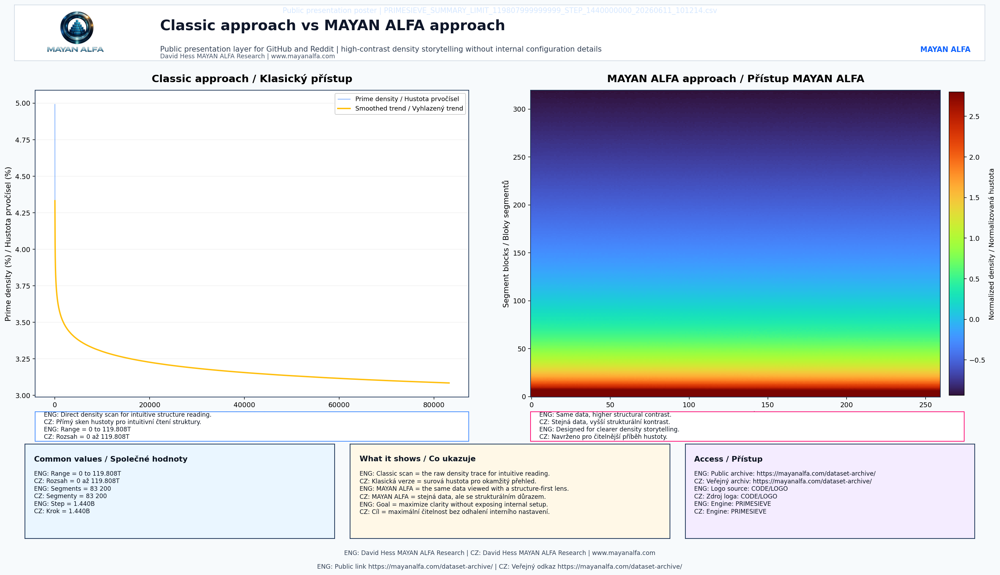
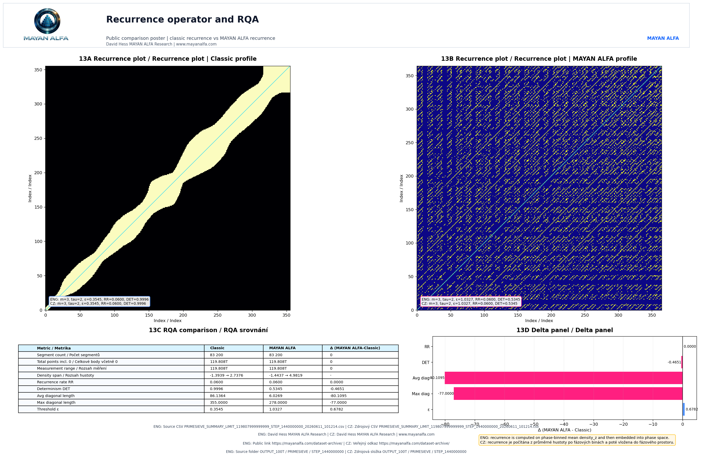
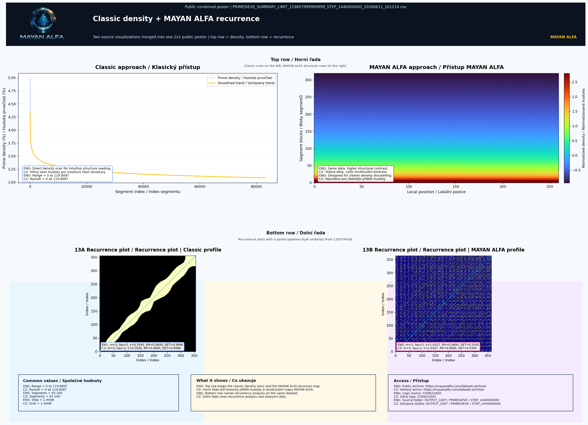
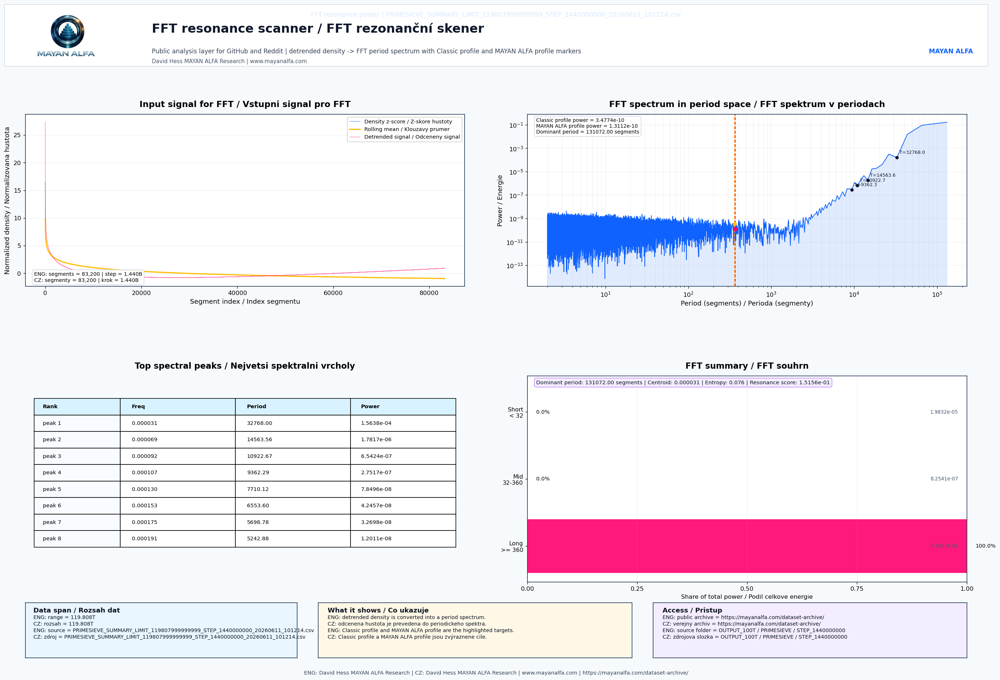
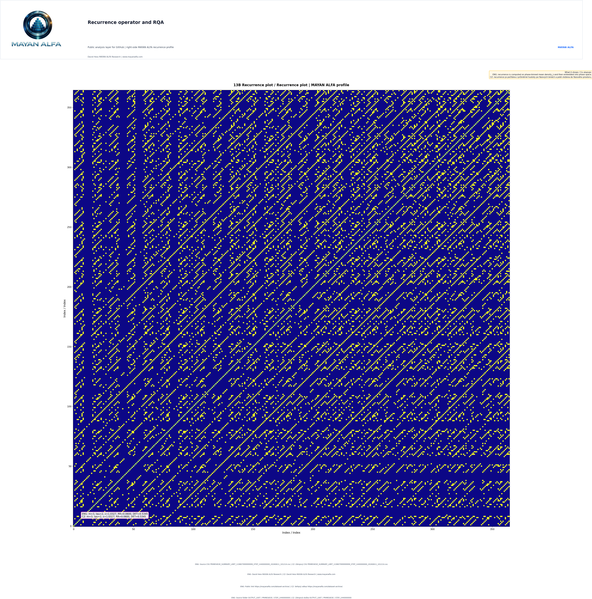

# GITHUB_PUBLIC

English

This folder is the public GitHub publication workspace for the project
`High_Contrast_Phase_Binning_Recurrence_Operators`
(`High-Contrast Phase-Binning Recurrence Operators and Frequency Resonance Analysis for Large-Scale Prime Number Density Distribution up to 119.8 Trillion Units`).

It is wired to the local `CODE/GITHUB_PRESENTATION` workflow and is intended
to hold only public-safe release material:
- selected source reports
- public graphs exported from `13GITHHUB1.py` through `13GITHHUB5.py`
- the canonical `08_GOVERNANCE_CENTER`
- paper, QA, and release staging folders

Use this folder as the controlled handoff target when preparing a GitHub
public release slice. The public dataset is exported as a ZIP archive built
directly from the source output tree, and the export is protected by
`SHA256SUMS.txt` plus `PACKAGE_SHA256.txt`.

## Description

This dataset and analysis framework introduce methodologies for mapping and
analyzing the structural, topological, and spectral properties of prime number
distributions at large scale. Using a high-performance framework optimized for
massive mathematical datasets, we evaluate prime density across
`119.808 Trillion` integers, structured into `83,200` analytical segments
with a uniform step size of `1.440 Billion` units.

While conventional approaches visualize prime density as a monotonically
decreasing asymptotic curve, they do not expose local fluctuations and
macro/micro-structural organization. To bridge this gap, the MAYAN_ALFA engine
aplikuje dvouvrstvý pipeline:

1. Horní řádek: transformuje 1D stopy hustoty do 2D vysoce kontrastní prostorové
matice (Phase-Binned Spectrogram), odhalující stratifikaci hustoty a
topografii hranic.
2. Spodní řádek: porovnává klasické rekurenční profilování s proprietárním
rekurenčním operátorem MAYAN ALFA. Klasické RQA vytváří homogenní
makro-pásmo, zatímco MAYAN ALFA používá techniku ​​vkládání fázového binningu s průměrnou hustotou,
která snižuje determinismus a odhaluje selektivnější mikrostruktury.

Toto úložiště obsahuje plakáty s unifikovaným benchmarkingem ve vysokém rozlišení,
kanonické analytické metriky (`.csv` / `.txt`) zabalené do veřejného archivu ZIP
datové sady a strukturální metadata potřebná k reprodukci veřejné
sady vizualizací.

## Technický přehled

Analytický kanál vyhodnocuje absolutní prvočíselné rozdělení od nuly
(`0`) až do `119,808 × 10^12`. Zpracovatelská zátěž je strukturována do
`83 200` spojitých segmentů s jednotnou velikostí kroku `1,440 × 10^9` jednotek.
Tento rámec sjednocuje dvě metodologické vrstvy do jednoho `2 × 1`
srovnávací veřejný plakát:

### Stratifikace hustoty

- Klasický přístup: vykresluje surovou hustotu primárních čísel a její vyhlazený trend. Ukazuje
ostrý počáteční vrchol v počátku a poté plochý spojitý pokles.
- Přístup MAYAN ALFA: mapuje stejnou datovou sadu do 2D segmentové blokové matice
pomocí normalizovaného barevného gradientu hustoty. Tím se monotónní křivka
převede na vysoce kontrastní strukturální topografii.

### Shrnutí srovnávacího RQA

| Metric / Metrika | Classic Profile / Klasický | MAYAN ALFA Profile / Profil | Δ (MAYAN ALFA - Classic) |
|---|---:|---:|---:|
| Segment Count / Počet segmentů | 83,200 | 83,200 | 0 |
| Total Points / Celkové body (incl. 0 / včetně 0) | 119.808 T | 119.808 T | 0 |
| Recurrence Rate / Hustota rekurence ($RR$) | 0.0600 | 0.0600 | 0.0000 |
| Determinism / Determinismus ($DET$) | 0.9996 | 0.5345 | -0.4651 |
| Avg Diagonal Length / Průměrná délka ($L_{avg}$) | 86.1364 | 6.0269 | -80.1095 |
| Max Diagonal Length / Maximální délka ($L_{max}$) | 355.0000 | 278.0000 | -77.0000 |
| Threshold / Práh ($\epsilon$) | 0.3545 | 1.0327 | +0.6782 |

### Methodological Insights

Classic RQA uses a low threshold (`ε = 0.3545`), resulting in an
uninformative continuous band along the Line of Identity (LOI), indicating a
trivial local correlation (`DET → 1`).

The MAYAN ALFA operator computes recurrence on the phase-binned mean density
before embedding it into phase space. Despite a higher threshold
(`ε = 1.0327`), it keeps the same `RR = 0.0600` while fracturing the
macro-shroud.

The result is a drop in `DET` to `0.5345` and a decrease in average diagonal
length from `86.1` to `6.0`. This geometric decomposition isolates an
ultra-fine deterministic network of micro-lines, indicating structural
periodicity hidden deep within the distribution.

## Graph Guide / Průvodce grafy

### 13GITHHUB1 - Classic density view vs. MAYAN ALFA density mapping

**EN**

This figure is the entry point to the public visual set. The left side shows a
classic 2D density curve with a smoothed asymptotic trend, while the right side
shows the same data reorganized into a high-contrast phase-binned matrix.

Observed notes:
- the classic view stays smooth and monotonic, so local fluctuations are hard
  to see
- the MAYAN ALFA view exposes layered density structure and sharper boundary
  topography
- both views use the same public range: 119.808T integers, 83,200 segments,
  step 1.440B, including 0

**CZ**

Tento graf je vstupní branou do veřejné vizuální sady. Levá strana ukazuje
klasickou 2D křivku hustoty s vyhlazeným asymptotickým trendem, zatímco pravá
strana ukazuje stejná data reorganizovaná do vysokokontrastní matice s fázovým
binováním.

Pozorování:
- klasický pohled zůstává hladký a monotónní, takže lokální fluktuace jsou
  obtížně viditelné
- pohled MAYAN ALFA odhaluje vrstevnatou strukturu hustoty a ostřejší topografii
  rozhraní
- oba pohledy používají stejný veřejný rozsah: 119.808T celých čísel, 83 200
  segmentů, krok 1.440B, včetně 0

### 13GITHHUB2 - Recurrence operator and RQA

**EN**

This figure compares classic recurrence profiling with the MAYAN ALFA recurrence
operator on the same massive public dataset. The main observation is not a change
in recurrence rate, but a change in structure.

Observed notes:
- RR stays at 0.0600 for both profiles
- DET drops from 0.9996 to 0.5345
- average diagonal length drops from 86.1364 to 6.0269
- the classic profile appears as a broad continuous band
- the MAYAN ALFA profile reveals selective micro-structure after recurrence is
  computed from mean density over phase bins and embedded into phase space

**CZ**

Tento graf porovnává klasické profilování recurrence s MAYAN ALFA operátorem na
stejném masivním veřejném datasetu. Hlavní pozorování není změna hustoty
rekurence, ale změna struktury.

Pozorování:
- RR zůstává 0.0600 u obou profilů
- DET klesá z 0.9996 na 0.5345
- průměrná délka diagonály klesá z 86.1364 na 6.0269
- klasický profil působí jako široké souvislé pásmo
- MAYAN ALFA profil odhaluje selektivní mikrostrukturu poté, co se recurrence
  počítá z průměrné hustoty po fázových binách a vloží do fázového prostoru

### 13GITHHUB3 - Combined bridge view

**EN**

This figure combines the first two public views into a single bridge between
density visualization and recurrence analysis. It is designed to help the reader
move from the classical trend to the structured MAYAN ALFA observations without
breaking the public release boundary.

Observed notes:
- it acts as a transition panel between density mapping and recurrence analysis
- it keeps the large-scale statistical boundary intact
- it prepares the reader for the FFT-based interpretation in `13GITHHUB4`

**CZ**

Tento graf spojuje první dva veřejné pohledy do jednoho mostu mezi vizualizací
hustoty a analýzou recurrence. Je navržen tak, aby čtenáře provedl od klasického
trendu ke strukturovaným pozorováním MAYAN ALFA bez narušení veřejné hranice.

Pozorování:
- funguje jako přechodový panel mezi mapou hustoty a analýzou recurrence
- zachovává velkoškálovou statistickou hranici
- připravuje čtenáře na FFT interpretaci v `13GITHHUB4`

### 13GITHHUB4 - FFT resonance analysis

**EN**

This figure extends the public analysis into the frequency domain. The FFT view
first removes the dominant asymptotic trend, then inspects the remaining
periodicity and energy distribution.

Observed notes:
- the short-period range shows a strong low-noise floor
- energy rises around period ~300 segments
- dominant long-period structure is concentrated at the high end of the period
scale
- spectral entropy is very low, reported as 0.078
- the main message is that meaningful structure lives in long waves, not in
short noisy fluctuations

**CZ**

Tento graf rozšiřuje veřejnou analýzu do frekvenční domény. FFT pohled nejprve
odstraní dominantní asymptotický trend a pak zkoumá zbývající periodicitu a
rozložení energie.

Pozorování:
- krátkoperiodní rozsah má silné nízkošumové dno
- energie začíná růst kolem periody přibližně 300 segmentů
- dominantní dlouhoperiodní struktura je soustředěna ve vysoké části
periodické škály
- spektrální entropie je velmi nízká, uvedená jako 0.078
- hlavní sdělení je, že významná struktura leží v dlouhých vlnách, nikoli v
krátkých šumových fluktuacích

### 13GITHHUB5 - High-resolution right-side recurrence plot

**EN**

This is the close-up public recurrence view for the MAYAN ALFA profile. It is
the most detailed plot in the release and is intended to show the internal
organization of the recurrence field as a high-resolution right-side panel.

Observed notes:
- the plot is highly organized rather than random
- repeating vertical and horizontal traces are visible across the field
- short diagonal segments appear in clustered, structured patterns
- the figure highlights stable recurrence traces and micro-regularity at a
  finer visual scale

### Public packaging note

The dataset evidence is published as `datasets/STEP_1440000000.zip`. That ZIP
is built directly from the source output tree and then included in the public
GitHub and Zenodo exports together with the checksum and audit files.

## Automated Public Slices

Two helper slices automate the public release export:
- `_PUBLIC_GITHUB/` builds the GitHub-facing public package
- `_PUBLIC_ZENODO/` builds the Zenodo-facing archival package

The workflow script `run_public_release_workflow.py` creates the export under
each helper slice's `export/` directory.

Each export includes:
- `AUDIT_HIDDEN_ARTIFACTS.txt`
- `SHA256SUMS.txt`
- `PACKAGE_SHA256.txt`

The export audit checks for hidden artifacts and the checksum layer protects the
full bundle.

**CZ**

Toto je detailní veřejný recurrence pohled pro profil MAYAN ALFA. Jde o
nejdetailnější graf v release a má ukázat vnitřní organizaci recurrence pole
jako vysokorozlišovací pravý panel.

Pozorování:
- graf působí vysoce organizovaně, nikoli náhodně
- přes pole jsou viditelné opakující se vertikální a horizontální stopy
- krátké diagonální úseky se objevují ve shlucích a strukturovaných vzorech
- figura zvýrazňuje stabilní recurrence stopy a mikro-regularitu v jemnější
vizuální škále

## LICENSE MATRIX

| Layer | License |
|---|---|
| Public Papers | CC BY-NC-ND 4.0 |
| Public CSV Datasets | CC BY-NC 4.0 |
| MAYAN_ALFA Core Engine | All Rights Reserved |
| Observation Registry | Private |

Verified prime generation was performed using PrimeSieve by Kim Walisch,
released under the BSD-2-Clause license.

## MAYAN_ALFA TERMS OF USE

Allowed public use:
- reading and reviewing public reports,
- reproducing public benchmark methodology where possible,
- citing the project,
- using public graphs and tables with attribution,
- academic or educational discussion.

Not allowed without written permission:
- commercial resale,
- redistribution of restricted or private layers,
- removal of attribution,
- claiming authorship,
- presenting observations as guaranteed universal mathematical claims,
- using MAYAN_ALFA as a cryptographic assurance tool.

Česky (CZ)

Tato složka je veřejný pracovní prostor pro GitHub release projektu
`High_Contrast_Phase_Binning_Recurrence_Operators`
(`Vysokokontrastní rekurenční operátory s fázovým binováním a frekvenční rezonanční analýza pro velkoobjemovou distribuci hustoty prvočísel do 119,8 bilionu jednotek`).

Je napojená na místní workflow `CODE/GITHUB_PRESENTATION` a má obsahovat jen
public-safe materiál pro release:
- vybrané zdrojové reporty
- veřejné grafy vyexportované z `13GITHHUB1.py` až `13GITHHUB5.py`
- kanonické `08_GOVERNANCE_CENTER`
- složky pro paper, QA a release staging

Používejte ji jako řízený předávací bod pro GitHub veřejný release výřez.

## Abstrakt

Tento dataset a analytický framework představují metodologie pro mapování a
analýzu strukturních, topologických a spektrálních vlastností distribuce
prvočísel ve velkém měřítku. S využitím vysoce výkonného frameworku
optimalizovaného pro masivní matematické datasety vyhodnocujeme distribuci
hustoty prvočísel v rozsahu `119,808 bilionu` (`119,808 × 10^12`) celých čísel,
rozdělených do `83 200` analytických segmentů s jednotnou velikostí kroku
`1,440 miliardy` jednotek.

Zatímco konvenční přístupy vizualizují hustotu prvočísel jako monotonicky
klesající asymptotickou křivku, selhávají při odhalování lokálních fluktuací
a makro/mikrostrukturní organizace. K překonání tohoto omezení aplikuje jádro
MAYAN_ALFA dvouvrstvý proces:

1. Horní řada (Příběh hustoty / Density Storytelling): transformace 1D
trajektorie hustoty do 2D vysokokontrastní prostorové matice
(spektrogramu s fázovým binováním), odhalující rigidní stratifikaci hustoty
a topografii rozhraní bez odhalení interního nastavení algoritmů.
2. Dolní řada (Analýza kvantifikace rekurence - RQA): komparativní topologická
studie mezi klasickým profilováním rekurence a proprietárním rekurenčním
operátorem MAYAN ALFA. Zatímco klasická RQA vede k homogennímu pásu,
operátor MAYAN ALFA využívá techniku vkládání průměrné hustoty po fázových
binách. Tím se determinismus (`DET`) posouvá z triviální hodnoty `0,9996`
dolů na `0,5345`.

Tento repozitář obsahuje benchmarkingové plakáty ve vysokém rozlišení, surové
analytické metriky (`.csv` / `.txt`) a strukturní metadata nezbytná pro
replikaci topologických fázových posunů a spektrálních otisků.

## Technický přehled
# GITHUB_PUBLIC
Analytická pipeline vyhodnocuje absolutní distribuci prvočísel začínající od
nuly (`0`) až do hodnoty `119,808 × 10^12`. Výpočetní kapacita je strukturována
do `83 200` spojitých segmentů s jednotnou velikostí kroku `1,440 × 10^9`
jednotek. Framework sjednocuje dvě odlišné metodologické vrstvy do jednoho
komparativního veřejného plakátu o rozvržení `2 × 1`.

### Stratifikace hustoty

- Klasický přístup vykresluje surovou hustotu prvočísel a její vyhlazený trend.
Vykazuje ostrý počáteční pík v počátku (`0`), následovaný plochým
kontinuálním poklesem.
- Přístup MAYAN ALFA mapuje identický dataset do 2D matice segmentových bloků
za použití normalizovaného barevného gradientu hustoty. Tím se monotonní
křivka mění na vysokokontrastní strukturní topografii.

### Srovnávací RQA souhrn

| Metric / Metrika | Classic Profile / Klasický | MAYAN ALFA Profile / Profil | Δ (MAYAN ALFA - Classic) |
|---|---:|---:|---:|
| Segment Count / Počet segmentů | 83,200 | 83,200 | 0 |
| Total Points / Celkové body (incl. 0 / včetně 0) | 119.808 T | 119.808 T | 0 |
| Recurrence Rate / Hustota rekurence ($RR$) | 0.0600 | 0.0600 | 0.0000 |
| Determinism / Determinismus ($DET$) | 0.9996 | 0.5345 | -0.4651 |
| Avg Diagonal Length / Průměrná délka ($L_{avg}$) | 86.1364 | 6.0269 | -80.1095 |
| Max Diagonal Length / Maximální délka ($L_{max}$) | 355.0000 | 278.0000 | -77.0000 |
| Threshold / Práh ($\epsilon$) | 0.3545 | 1.0327 | +0.6782 |

### Metodologické poznatky

Klasická RQA využívá nízký práh (`ε = 0,3545`), což vede k neinformativnímu
kontinuálnímu pásu podél hlavní diagonály (LOI) a značí triviální lokální
korelaci (`DET → 1`).

Operátor MAYAN ALFA počítá rekurenci z průměrné hustoty po fázových binách
před jejím vložením do fázového prostoru. Navzdory vyššímu prahu
(`ε = 1,0327`) zachovává stejné `RR = 0,0600`, přičemž úspěšně tříští
makroskopický závoj.

Výsledek: `DET` klesá na `0,5345` a průměrná délka diagonály se snižuje
z `86,1` na `6,0`. Tato geometrická dekompozice izoluje ultra-jemnou,
vysoce deterministickou síť mikrolinií, což indikuje strukturní periodicitu
skrytou hluboko uvnitř distribuce prvočísel.

## LICENSE MATRIX

| Layer | License |
|---|---|
| Public Papers | CC BY-NC-ND 4.0 |
| Public CSV Datasets | CC BY-NC 4.0 |
| MAYAN_ALFA Core Engine | All Rights Reserved |
| Observation Registry | Private |

Ověřené generování prvočísel bylo provedeno pomocí PrimeSieve od Kimwalisch,
vydaného pod licencí BSD-2-Clause.

## PODMÍNKY POUŽITÍ MAYAN_ALFA

Povolené veřejné použití:
- čtení a kontrola veřejných zpráv,
- pokud je to možné, reprodukce metodiky veřejných benchmarků,
- citování projektu,
- používání veřejných grafů a tabulek s uvedením zdroje,
- akademická nebo vzdělávací diskuse.

Bez písemného povolení není dovoleno:
- obchodní další prodej,
- přerozdělování omezených nebo soukromých vrstev,
- odstranění uvedení autorství,
- přisvojování autorství,
- prezentování pozorování jako zaručených univerzálních matematických tvrzení,
- používání MAYAN_ALFA jako nástroje kryptografického zajištění.
